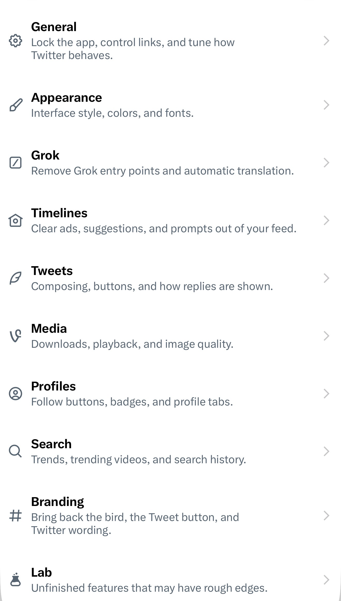
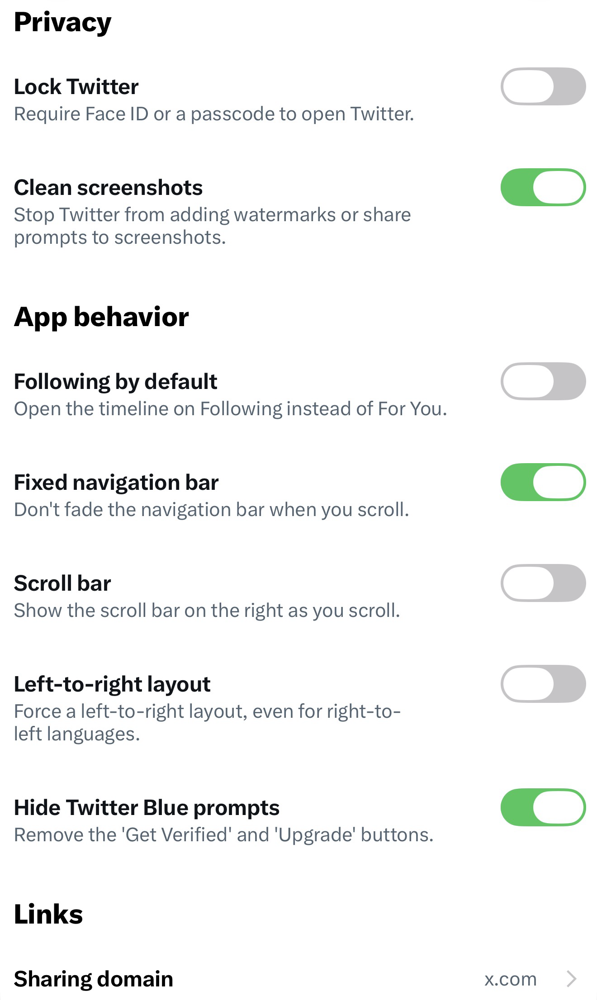
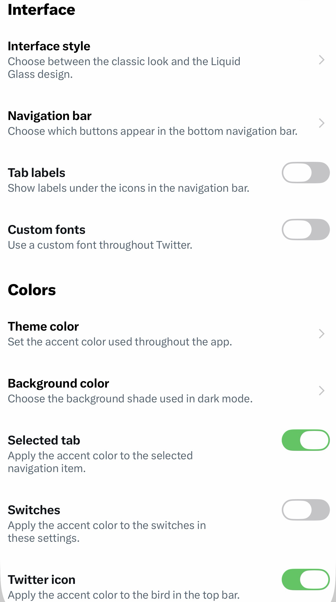

    

  # PrimeFreeBird
  <i>A Twitter/X tweak — reworked for iOS 26 &amp; Liquid Glass.</i>

 

| | | |
|:-------------------------:|:-------------------------:|:-------------------------:|
||||

Everything below is new in this fork, on top of NeoFreeBird.

# What's new

## Explore

- **Per-tab control** — hide any of For You, Trending, News, Sports or Entertainment, instead of hiding the whole Explore page.
- **Swiping stays native** — the pager only holds the tabs you keep: no blank pages, no ghost tabs, and the underline tracks the tab you're on.
- **Advanced search** — X ships this form on the web only. It's here, native: words, accounts, language, filters, engagement and dates, with results in Twitter's own search screen.

## Liquid Glass

- **Liquid Glass, enabled** — the stock app opts out of iOS 26's redesign; this turns it back on, or keeps the standard look.

## Colour theme

- **Any colour you want** — a *Custom accent colour* row opens the native iOS picker, instead of choosing from a fixed set of presets.
- **Applied everywhere** — the bird, links, @mentions, #hashtags and buttons all follow your colour, not just the logo.
- **Independent accents** — the compose button, the selected tab and the Confirm button each follow it, or keep Twitter blue.
- **Predictable reset** — resetting returns to stock and stays there, across restarts and re-picks.
- **Dark shades** — System, Dim, Gray or Blackout.
- **Coloured switches** — the settings switches follow your accent too.

## Muted words

- **Words, phrases or accounts** — one list: type a word, a phrase, or an @account, and the type is recognised on its own.
- **Quick access from your feed** — an icon in the timeline's top bar opens a small popover to add or remove a filter without leaving your scroll.
- **Precise by default** — whole-word matching so "cat" never catches "concatenate", and the list applies to replies as well.

## Timeline

- **Unlimited timeline tabs** — pin far more lists and topics than X allows, and unlock advanced tabs like Ranked Following.
- **Hide topics** — both topic posts and "Topics to follow".
- **Open in Following** — start on the Following tab instead of For You.
- **Preload media** — images and videos are ready the moment you scroll to them.
- **Clean screenshots** — an on/off toggle for Twitter's screenshot detection.

## Media

- **Full HD uploads** — send your own videos in 1080p.
- **No mini player** — full-screen videos no longer shrink into a floating player when you drag them away.

## Tweets &amp; profiles

- **Hide the Tweet button** — remove the compose button from the timeline.
- **Classic compose button** — or bring back the bird on a coloured circle instead of the native "+".
- **Profile URL** — added to the copy-profile-details button.
- **Clean shared links** — tracking parameters stripped when you copy *or* share, profiles included.

## Reply in Web View

- **One-time web login** — sign in once in Settings → Lab; the session is saved on-device and cleared in one tap.
- **Native icon bar** — the composer's toolbar is a real iOS bar that follows the keyboard.

## Elsewhere

- **Grouped settings** — every page is split into labelled groups instead of one long list.
- **Full French localization** — every string, including the new screens.

# Fixes

- **Tab labels are centred** — restored labels no longer sit off-centre after a cold launch.
- **The video timestamp shows up** — the option now actually reveals the elapsed time in full-screen videos.
- **"Open in Following" is honoured** — the setting was silently overridden; the tab you pick now survives a new session.
- **No black launch screen** — the blue splash also appears on a fresh install.
- **The Spaces bar fully collapses** — hiding it no longer leaves an empty blurred strip.
- **Pull-to-refresh sound works again** — rebuilt for current Twitter versions, where the old hook no longer exists.
- **Reply composer sits still** — no keyboard bounce, no doubled insets, no login wall.

…on top of the full BHTwitter and NeoFreeBird toolkit.

# Credits

- [**BHTwitter**](https://github.com/BandarHL/BHTwitter) by BandarHL — the foundation this is built on.
- The [**NeoFreeBird**](https://github.com/NeoFreeBird) project — the base this fork tracks.
- [**scar**](https://github.com/theacrat/scar) by theacrat — the branding pipeline.
